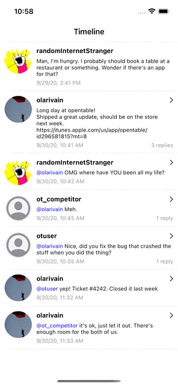

A Note From Doug
----------------

Howdy! This was fun. I, of course, ended up getting off in the weeds building a service for fetching, processing, and caching avatar images, before telling myself that's WAY out of scope, and to knock it off, even though I stopped short of actually caching assets between launches.

The git commit history could have been a lot cleaner if I had a better plan for tackling this. I would be ashamed to send in a PR in a team where someone had to make sense of my approach from what you see in main here. Sorry!

I think I handled the basics within a couple hours, but it's been piecemeal working on it today, with a lot of interruptions and context switching. Fetching / parsing / displaying everything was pretty trivial.

I'm also a bit rusty dealing with XIBs / storyboard, and there was a good bit of head-scratching over nominally trivial things, which reminded me of why I hate them to begin with (for instance, missing constraints on the UITableView, which caused cells to make the table bigger, but by just barely enough that it wasn't obvious what was happening. yay.)

I think was probably also too clever by half in extending the TimelineViewController to handle both threads and the root timeline, as it ended up taking me down a road where separation of concerns was broken little by little, and my "model" ended up having way too much involvement with setting cell propeties and such. I cleaned that up a bit in the last couple commits, but still, it needs refactoring, and isn't very testable as-is.

I'm also, unfortunately, chronically unable to say no to a challenge, and couldn't resist going after all the bonus stuff, even if it added a couple hours to the dev time. It was fun. Sue me :)

Things I WISH I could have done, but I'm already probably way over the time you wanted me to spend...

- Friendly date display (i.e. "40 minutes ago")
- Displaying dates in the user's timezone (I'm assuming dates in the data are UTC)
- Better UX for threading (i.e. if I'm in a thread, where's the tweet I tapped to take me there?)
- Better separation of concerns between view controller and model. It's a mess.
- API caching of JSON response, so multiple models don't have to re-fetch it (theoretical concern, but still)
- Persistent caching of avatar URLs, and probably a pass at making that section more readable
- Tracking down the inevitable race condition causing avatar image setting to behave strangely when reusing cells
- Edge cases where reply counts aren't correct in Thread views.
- Figure out why the UINavigationController I shoved in there isn't responding to dark mode changes.
- More unidirectional data flow via some kind of observer pattern (i.e. combine), instead of the old-school MVC approach I used, where the VC manually refreshes data. Not very modern.
- Cleanup the cheesy zoom-on-select animation. I can think of better ways to do it, but they all demand some refactoring of the cell view hierarchy.

Thanks for taking the time to check this out, and I hope we get to talk further in the future!

OpenTweet
=========

Hi! Welcome to your iOS coding excercise.

This is a very simple twitter like client. You'll find a json file under Data/ with a short tweet timeline. You are asked to write the app that will display the tweets, similar to what a Twitter client would do.

A tweet has at the minimum:

* An id
* An author
* A content (e.g. the actual tweet)
* A date (text format, in the standard ISO-8601 format)

Additionally, a tweet may have:

* A reference to the tweet ID it's replying to
* A URL to the user's avatar
* A list of image URLs

The timeline is a chronologically ordered (ascending order) list of tweets.

Since the topic is very simple, yet offers so many possibilities at the same time, there is a minimum requirement, and bonuses.

Minimum requirement
-------------------

* Fork the repo
* Parse the json file included in the project
* Display the tweets in the order the json file defines them. The app should display the author, the tweet and the date it was tweeted at. Tweets are variable length, so the cells must be properly sized to the content
* When done, send a pull request to this project (e.g don't email me your project :))

Keep in mind that the repo is public, so forking and sending a pull request will be shown in your public GitHub activity. If that doesn't work out for you for whatever reason, you can simply clone the repo locally, and submit your work back as a zip file to the recruiter.

Bonuses (in no particular order)
--------------------------------

* Highlight the mentions (@username) and/or links in a different font/color
* Display a tweet's thread when tapping on a giving tweet. Due to the very simplistic data model made available to you, it's probably best to simplify this: if the user taps on the first tweet of a thread, display all the replies in ascending chronological order, if the user taps on a reply to another tweet, only show the tapped tweet and the tweet it's replying to.
* Display avatar images (feel free to use AFNetworking/AlamoFire or just use NSURLSession for that)
* Animate/highlight a tweet when it is selected (e.g. make it "bigger", in an animated fashion)
* Anything else you might think of that showcases a UIKit feature: UIDynamics, parallax effect, the list is endless.

What the assignment will be judged on
-------------------------------------

* Accuracy of the result (e.g. is the cell sizing pixel perfect, dates are properly formatted, the app doesn't crash, project builds and runs with no extra step, etc.)
* Proper usage of UIKit apis (e.g. are cells properly reused, a back button must have a proper title, how well does it scale to various device sizes, etc.)
* Overall code quality: clarity, conciseness, quality of comments. Robustness and maintainability matter a lot more than clever one liners.
* If you end up short on time and/or can't fix a specific bug or finish a given feature, update this readme with what the bug is, and how you think you can fix had you more time.
* Bonuses are exactly that, bonuses. If you can complete one or more, good. Otherwise, don't sweat it
* If you can't complete something, explain why, how you reached that conclusion and potential options to complete it.

What the assignment will NOT be judged on
-----------------------------------------

* Visual design. This is a UI coding excercise, not a visual design excercise. 
* UI performance (e.g. framerate), as long as it's reasonable. Feel free to indicate in the code if/why something would affect the framerate, and a potential solution to it.
* If you try to complete a bonus and can't finish it, that's fine. I'd recommend using git commits/tags to indicate where the bonuses start in the history, so we can easily reset the branch at that commit and validate the minimum requirement.

Happy coding!
